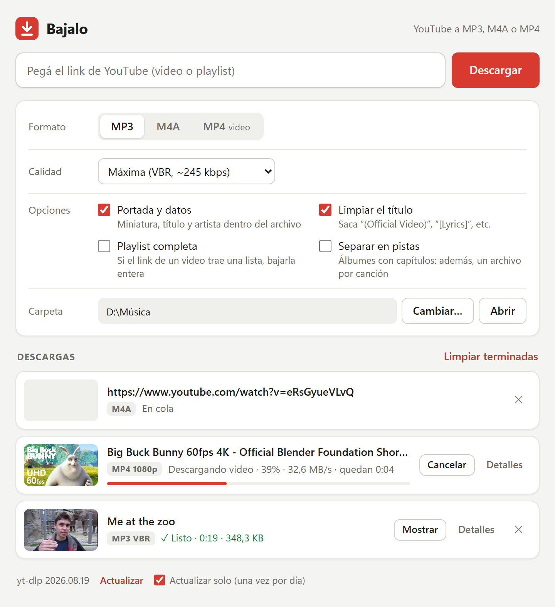

# MediaFetch

Pegá el link de YouTube y bajalo. Una ventana simple para descargar música y videos, hecha sobre [yt-dlp](https://github.com/yt-dlp/yt-dlp) y [FFmpeg](https://ffmpeg.org). Para Windows 10 y 11.



## Qué hace

- **MP3** (máxima calidad VBR o 320/192/128 kbps), **M4A** sin recodificar o **MP4** (hasta 1080p, 720p, 480p o la máxima).
- Guarda la portada, el título y el artista dentro del archivo.
- Limpia los títulos: saca "(Official Video)", "[Lyrics]", "(Video Oficial)", etc.
- Playlists enteras, en una carpeta y numeradas.
- Álbumes subidos como un solo video: si tiene capítulos, además arma una pista por canción, con su título y número.
- Saca el audio de videos de la compu (.wmv, .mp4, .mkv…) a un MP3 liviano para voz (mono, 16 kHz, 32 kbps). Queda al lado del video.
- Transcribe videos y audios de la compu con Whisper large-v3 (vía Groq, gratis): deja un `.txt` al lado del archivo, con la hora de cada frase.
- Cola de descargas con progreso; se pueden cancelar y reintentar.
- Mantiene yt-dlp actualizado solo (una vez por día), porque YouTube cambia seguido y las versiones viejas dejan de andar.

## Instalación

1. Bajá **MediaFetch-win64.zip** de la [última versión](https://github.com/LeandroCaballero/bajalo/releases/latest).
2. Descomprimilo: clic derecho → **Extraer todo**.
3. Abrí la carpeta **MediaFetch** y hacé doble clic en **MediaFetch.exe**.

Trae todo adentro (Node.js, yt-dlp y FFmpeg): no hay que instalar nada ni pide permisos de administrador. Para desinstalarlo, borrá la carpeta.

La primera vez, Windows puede avisar que "protegió tu PC" porque `MediaFetch.exe` no está firmado: tocá **Más información** y después **Ejecutar de todas formas**. Para que no aparezca, antes de descomprimir: clic derecho en el ZIP → **Propiedades** → **Desbloquear**.

Para actualizar, bajá el ZIP nuevo y reemplazá la carpeta. Lo que bajaste no se pierde, porque queda en **Música\MediaFetch**. Si querés conservar las opciones y la clave de Groq, copiá `app\settings.json` de la carpeta vieja a la nueva.

## Uso

Doble clic en **MediaFetch.exe**. Se abre la ventana (con Edge, Chrome o Brave; si no hay ninguno, en el navegador por defecto). Pegá el link y dale a **Descargar**. Los archivos van a **Música\MediaFetch** o a la carpeta que elijas.

Si tenés OneDrive, Google Drive, Dropbox o iCloud en la compu, abajo de la carpeta aparece **Guardar en:** con esas nubes, para elegirlas con un clic. Se guarda en una carpeta MediaFetch adentro de la nube y el programa de la nube lo sube solo. Si no elegís ninguna, no cambia nada.

Cuando cerrás la ventana, MediaFetch se cierra del todo en unos segundos. Si hay descargas en curso, antes te pregunta: si cerrás igual, se cancelan.

`bin\download.bat` es la versión de consola: pide el link y baja el MP3 a Música\MediaFetch, sin opciones.

## Transcribir

MediaFetch transcribe con Whisper large-v3 a través de [Groq](https://console.groq.com), que es gratis con límites (unas 2 horas de audio por hora).

1. Creá una cuenta y una clave en [console.groq.com/keys](https://console.groq.com/keys).
2. Pegala en **Opciones → Transcribir** y tocá **Guardar**.
3. Tocá **Transcribir a texto…** y elegí videos o audios. El `.txt` queda al lado de cada archivo.

La clave se guarda solo en `app/settings.json`, que no se sube al repo. Tené en cuenta que el audio se sube a los servidores de Groq.

## Si algo falla

- **"Windows protegió tu PC"**: ver [Instalación](#instalación).
- **HTTP Error 403**: casi siempre es yt-dlp desactualizado. Tocá **Actualizar**, abajo de la ventana, y reintentá.
- **"Sign in to confirm you're not a bot"**: YouTube está frenando tu conexión. Esperá un rato o probá desde otra red.
- Cada descarga tiene un botón **Detalles** con la salida completa de yt-dlp.

## Cómo está hecho

Sin paquetes npm ni frameworks: alcanza con Node, que viene adentro del ZIP.

- `MediaFetch.exe` ([`launcher/MediaFetch.cs`](launcher/MediaFetch.cs)): lanzador sin consola. Corre `bin\node.exe app\server.js` y, si algo falla, muestra el error en un cartel.
- `app/server.js`: servidor local que solo escucha en `127.0.0.1`. Corre yt-dlp, lee su progreso y se lo pasa a la ventana con Server-Sent Events. Se cierra cuando se cierra la ventana.
- `app/index.html`: la interfaz, en HTML, CSS y JavaScript sin frameworks.
- `tools/build.js`: arma la carpeta portátil y el ZIP, con las versiones y los SHA-256 de Node, yt-dlp y FFmpeg que fija `tools/dependencies.json`.
- `app/settings.json` y `app/server.log`: las opciones y el log de cada máquina (no se suben al repo).

## Desarrollo

Hace falta Node.js 22 o más nuevo, en Windows o en WSL:

```text
node tools/build.js
node --test
```

El primero baja Node, yt-dlp y FFmpeg a `bin/` y compila `MediaFetch.exe` con el compilador de C# que trae Windows; después, doble clic en `MediaFetch.exe`. Para depurar, `node app/server.js --serve` corre el servidor en primer plano en http://127.0.0.1:17865.

## Publicar una versión

```text
git tag v1.0.0
git push origin v1.0.0
```

La Action [Release](.github/workflows/release.yml) arma `MediaFetch-win64.zip` en un Windows de GitHub y lo publica como Release, con su SHA-256. Para probar el ZIP sin publicarlo: **Actions → Release → Run workflow**, y queda como artefacto. El repo tiene que ser público para que cualquiera pueda bajar los Releases.

En un repo público, cada ZIP sale con una certificación de GitHub que dice de qué commit de este repo se armó. Se verifica con:

```text
gh attestation verify MediaFetch-win64.zip --repo LeandroCaballero/mediafetch
```

## Aviso

Bajá solo contenido que tengas derecho a descargar, respetando los derechos de autor y los términos de YouTube.

## Licencia

[MIT](LICENSE). Node.js, yt-dlp y FFmpeg, que vienen dentro del ZIP, tienen sus propias licencias: ver [THIRD_PARTY_NOTICES.md](THIRD_PARTY_NOTICES.md).
